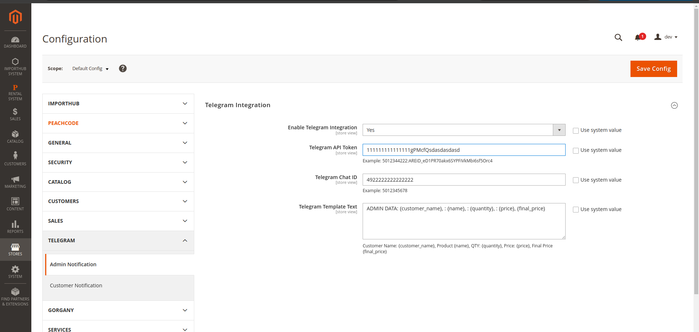

## Admin Configuration for Telegram Integration

Below is a screenshot of the Magento admin panel where you can configure Telegram integration:

---

### 1. Enable Telegram Integration

To start receiving Telegram notifications for new orders, you need to enable the integration and fill in the required fields.

---

### 2. How to Create a Telegram Bot and Get API Token

Follow these steps to create your Telegram bot and get the **API Token**:

1. Open Telegram and search for `@BotFather`.
2. Start a chat and send `/newbot`.
3. Provide a **name** and a **username** for your bot.
4. Once the bot is created, you will receive the **API Token**.

📌 **Example API Token**:
5012344222:ARElD_eD1PR70akxG5YPFVfkMbi6sf5Orc4

Copy and paste this token into the **Telegram API Token** field.

---

### 3. How to Get Your Telegram Chat ID

To receive messages, the bot needs to know your **Chat ID**.

1. Search for `@RawDataBot` in Telegram.
2. Start the bot by clicking **Start**.
3. The bot will send your account info.
4. Find the line starting with `"id"` inside the `"chat"` section.

📌 **Example Chat ID**:
5012345678

Paste this value into the **Telegram Chat ID** field.

---

### 4. Template for Notifications

You can customize the message template sent to Telegram. The following variables are available:
- `{customer_name}` – customer’s full name
- `{name}` – product name
- `{quantity}` – quantity ordered
- `{price}` – individual item price
- `{final_price}` – total price

📌 **Example Template**:
ADMIN DATA: {customer_name}, : {name}, : {quantity}, : {price}, {final_price}

---

### ✅ After Saving Configuration

Once you save the configuration and place a new order, a Telegram message will automatically be sent to the provided Chat ID with the order details.
