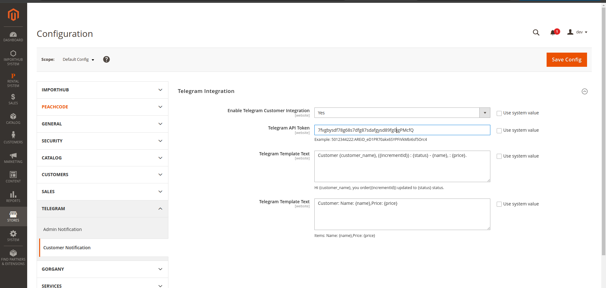
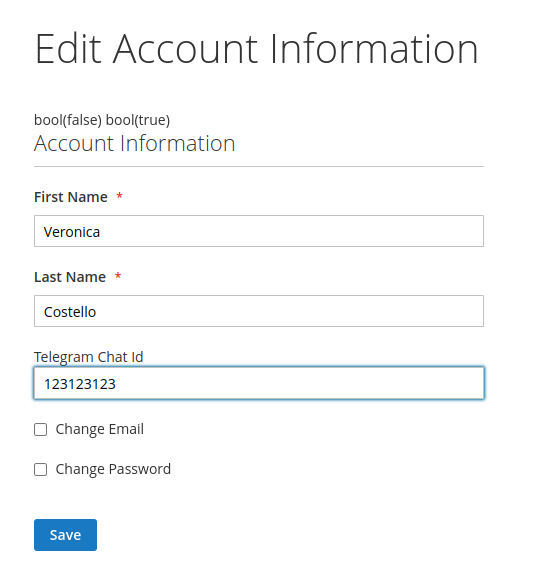

### 1. Telegram Bot Configuration

To enable Telegram notifications, you need to create a bot and retrieve its **API Token**.

Follow these steps:

1. Start a conversation with [**@BotFather**](https://t.me/BotFather).
2. Send `/newbot` to create a new bot.
3. Provide a **name** and a **unique username** for your bot.
4. Once created, BotFather will send back an **access token**.

📌 **Example API Token**:
5fghfgh678:1111_e124Arp0678678678hFiVkMbi6dk120000

This token will be required during configuration of the module.

---

### 2. Adding Telegram Chat ID

To receive order status updates via Telegram, users must enter their **Telegram Chat ID** in the field labeled `Telegram Chat ID` on the *Edit Account Information* page (see screenshot above).

#### How to Find Your Telegram Chat ID

1. Open Telegram and search for `@RawDataBot`.
2. Start a conversation by clicking **Start**.
3. The bot will send your account info.
4. Look for the section labeled `"chat"` and copy the value next to `"id"`.

📌 **Example Chat ID**:
123123123

Paste this number into the `Telegram Chat ID` field and click **Save**.

---

Once saved, the system will automatically send Telegram notifications to the provided Chat ID whenever the status of the user's order changes.
