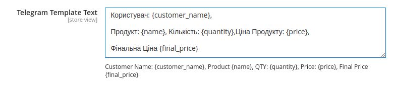

## About
Get Information about new order in telegram

<li>Start a new conversation with the BotFather( <a href="https://t.me/botfather">BotFather</a>  )</li>
<li>Send /newbot to create a new Telegram bot.</li> 
<li>When asked, enter a name for the bot.</li> 
<li>Give the Telegram bot a unique username.</li>
<li>Copy and save the Telegram bot's access token for later steps.</li> 
<ul>Example: 512345678:sGEiD_e124Arp0akAapbS6PFiVkMbi6dk12rc4</ul>
 
<b>How to Find a Telegram Chat ID</b>
<li>Type “@RawDataBot” and select “Telegram Bot Raw” from the drop-down list.</li>
<li>Click on the “Start” button in the auto-reply message.</li>
<li>The Telegram bot will send a message with your account info. 
Scroll down and find “Chat.” Your chat ID number is listed below, next to “id.’</li>

<h3>How config module?</h3> 
Admin-> Stores-> Configuration-> Telegram-> Admin Notification-> <b>Telegram Integration</b>
 
Insert <b>Access Token</b> & <b>Chat ID</b>

<h3>Feature</h3>
Customize Telegram Messages from the Admin Panel

You can modify the Telegram message text directly from the Magento admin panel.

For example, the default template looks like this:
Customer Name: {customer_name}, Product {name}, QTY: {quantity}, Price: {price}, Final Price: {final_price}

This template can be customized to fit your needs by using the available variables:

{customer_name} — the name of the customer
{name} — the product name
{quantity} — the product quantity
{price} — the product price
{final_price} — the total order amount
Here’s how it looks in the interface:

Example:
If you set the following template:
New order from {customer_name}. Items: {name} - QTY: {quantity}, Price: {price}. Total: {final_price}

You will receive a message in Telegram like this:
New order from John Doe. Items: Laptop - QTY: 2, Price: 1500. Total: 3000

Simple and flexible!

First: You need to start the recently created chat 
That's All!

After each order you will receive a message to Telegram
 
Example: <pre> New order from USERNAME, Product: ProductName QTY: 6 Price: 5, Product: ProductName QTY: 3 Price: 44</pre>

All errors you can find in  var/log/system.log
<pre>main.CRITICAL: Telegram connection is wrong. Warning: file_get_contents(https://api.telegram.org/botEXAMPLE:EXAMPLE/sendMessage?chat_id=123123123&amp;text=New+Order%3A+%D0%92%D0%BE%D0%BD%D1%8E%D1%87%D0%BA%D0%B0%2C+Items%3A++Product%3A+FFFF2222222+QTY%3A+10+Price%3A+44+Product%3A+wer+QTY%3A+10+Price%3A+5.+Price%3A+490): failed to open stream: HTTP request failed! HTTP/1.1 400 Bad Request
 in app/code/PeachCode/Telegram/Observer/TelegramObserver.php on line 80 [] []
</pre>
<h3>Enjoy!</h3>
<h6>Magento 2.4.7 Community</h6>